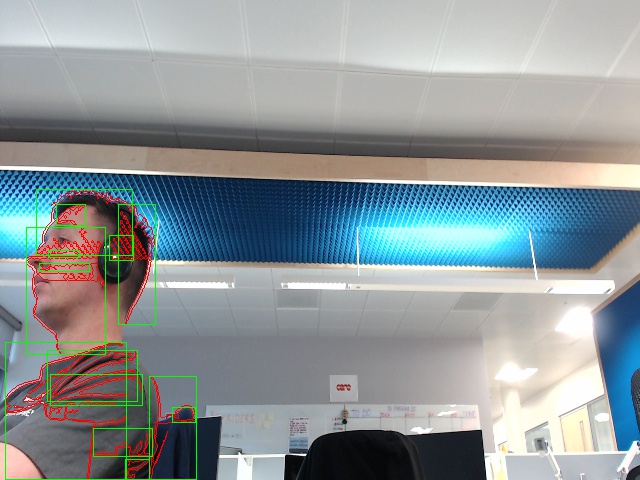
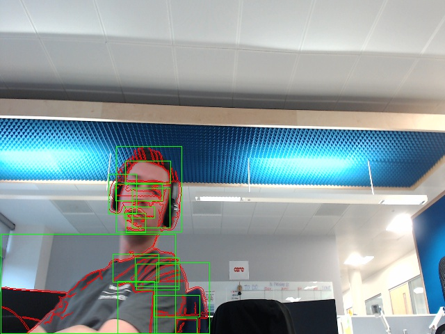

# Spring Boot Computer Vision Motion Detection from Webcam with OpenCV

1. Compile OpenCV on your Mac - `brew install homebrew/science/opencv --with-java`
2. Run `mvn initialize` to install the OpenCV jar in your local repo
3. `mvn package`
4. Execute with `java -jar target/motion-detect-0.0.1-SNAPSHOT.jar`

> Note: There are hardcodeds path to native libraries in this code that you 
> will want to update and it currently always uses the default system camera.

### Example Results

